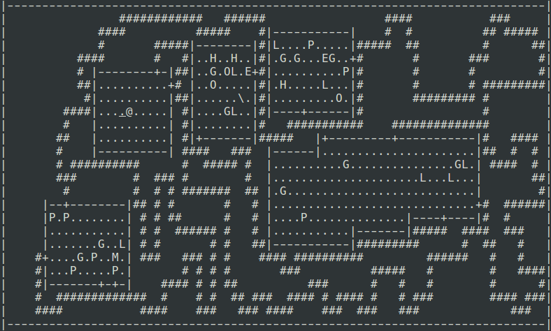
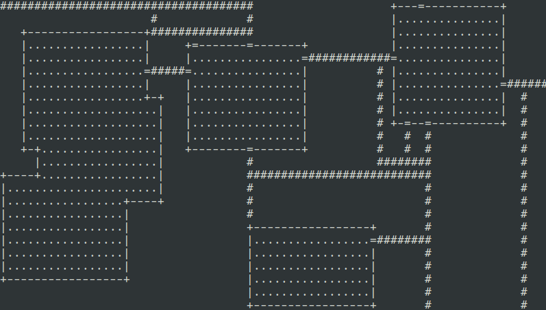
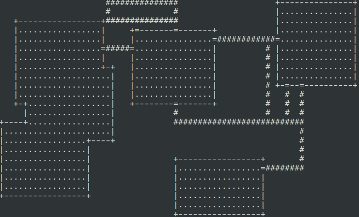

# {{ title }}

// {{ author }} &mdash; {{ date }}

Probably the most complicated part of making a Roguelike is making fun and
interesting dungeons. You could do it all by hand sure, but then there are only
so many floors you can have. No good. Instead, it must be generated randomly.

For the [game](/post/20170422) I am currently working on, I decided to improve on the algorithm I
used in CC3K (which was based on [this one](http://journal.stuffwithstuff.com/2014/12/21/rooms-and-mazes/)).
The dungeons it produced were pretty good, but the hallways were too windy.
Navigating them was more of a chore, and the sense of adventure you get from
wandering down them was lost as your fingers got gradually more and more
twisted. The algorithm itself is pretty neat, however, so if you're into that
stuff it's worth the read.

Also, the way I implemented it last time was a little weird. The CC3K project
said we had to be able to read in maps from a file, so I already had
string-to-dungeon conversions available. Re-using that feature, I just generated
the dungeon as a string and then read it from a `stringstream`. That, and the
fact that the code was just a mess, are why this needed a redo.

// Actual in-game footage of CC3K. Notice the long, snaky hallways.



### The algorithm

I call this blog-umentation. Honestly it's as much for me to not forget when I
come back to this as for anyone who is interested to know. Either way, here we
go.

#### Step 1: Placing the rooms

Starting from the blank dungeon, placing the rooms is pretty easy. Some
rectangles of varying sizes and locations are generated using the random
distributions `rx`, `ry`, `rw`, and `rh`. If no collisions occur between a
previous room and the newest one then it is placed into the dungeon.

I thought that having only rectangular rooms was pretty boring, so for every
room created, there's a chance it is allowed to be placed into the dungeon even
if it collides with another one. What this produces is a pretty evenly spaced
looking dungeon as below. Notice how some walls overlap in this picture.
Sometimes the entire room overlaps and makes a nice blobby shape too.

// Don't mind the player and stairs. I forgot to take them out.


At some point though, I ended up with only one giant room which, although cool,
would make for a pretty lame floor. So I was forced to add the `max_merges`,
which only allows half the potential rooms to be merged on any floor. That's
also why I had to use `count_if`, instead of just `any_of` to determine how many
rooms were colliding.

#### Step 2: The hallways

Adding hallways nicely is probably the hardest part, so I will break it down
better. The algorithm I used for CC3K was basically to fill every possible space
with a "perfect maze", and then carve out some doors to connect all the
sections. This time, hoping for straighter halls, I decided to do it more like
a graph.

The first step of course was to create the graph as follows:
1.  Find a non-empty cell, i.e., cells that have floor as opposed to the
    endless void that lies between the walls
2.  Flood fill this cell and all connected non-empty cells with `1`s
3.  Keep going until you find an unmarked non-empty cell, and repeat with the
    next numbers

The next step is to connect all these chunks of numbers with straight lines of
newly added non-empty cells so that every non-empty cell is part of the same
connected chunk. By extending from each side of every room a hallway that goes
as far as it can, every room will take up the entire length and width of the
dungeon and so be connected. Pretty simple.

My first attempt at implementing this, I allowed multiple hallways from each
side of every room. My thought was that by having a few extra halls there will
be more than one route from any two cells, which could add some good escape
routes from the monsters and reduce the linearity of everything.
This worked well when the RNG gave my lucky rolls, making some pretty intricate
dungeons, but when the numbers were bad it ended up with a lot of stripes that
went nowhere. Instead, I decided to have some chance of adding another hallway
after the dungeon was fully connected, which works much better.

It goes something like this:

```pseudo
while !all_connected or maybe_continue
  dir := one of(Up, Down, Left, Right)
  room := some random room
  xx, yy := some cell in room
  while cell[xx][yy] = Empty
    cell[xx][yy] := Hallway
    move xx, yy towards dir
  connect room to wherever we have reached
```

And you get something like this:



#### Step 3: The fat halls and dead ends

Maybe you noticed above that a lot of the hallways are not needed, particularly
all the dead ends and that bit that is two tiles thick. What I would prefer is
something like this:



There are still a few useless hallways, sure, but it's at least playable now.
Random cycles in the hallways are fine, I think. Just gives the player something
fun to explore for no reason. They still show up in some other part of the
dungeon. Dead ends just waste time.

Dead ends are pretty easy to find: If there is empty space or wall on 3 sides,
it's a dead end. Removing this one will often produce another, so recursively
"eat" the dead end hallway and continue.

The fat parts are another issue. What I came up with to be the determining
factor is as follows:
*   There must be one run of at least 4 consecutive hallways tiles around, as
    exemplified by the X tiles below. The O is ok.

    ```
    ### ### #_#
    #X_ #X# #O#
    ___ __# #_#
    ```

*   There must not be two disconnected runs of neighbouring tiles, even if one
    of them is 4 tiles or longer. See below:

    ```
    ### _## _## ###
    _O# #O# #O# _X#
    _#_ _## #__ ###
    ```

In the code, this is determined by doing a little more than one full rotation
around the tile in question, counting the tiles and looking for these
conditions. Oftentimes the neighbouring tiles are also fat, so they are
recursively eaten like the dead ends.

#### Step 4: Turn it into a dungeon

And then we're done! All that's left is to transform it from the abstract box
and graph representation to a concrete set of tiles and rooms, but that's easy.

Overall, I am pleased with how this turned out. Compared to the old CC3K
dungeons, these ones are much nicer to navigate, but still provide the same
randomness as before. The code is a little bit cleaner, 100 lines shorter, and
takes less time to compile than the other one (if that counts for anything) so
there are some physical improvements as well. If you are interested to see it,
check the [repository](https://github.com/oinkiguana/roguelike). The dungeon
generation is in `src/map.cc`.
